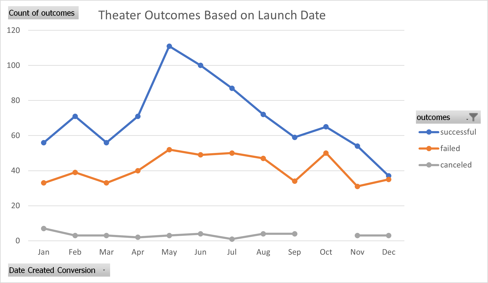

# Kickstarting with Excel Challenge

## Overview of Project

### Purpose
This is an analysis of Kickstarters ranging from 2009 to 2017 for Louise. Louise is interested in crowdfunding a play, so that is the data we will be paying attention to and analyzing. In particular, results and analysis for play outcomes based on goals and theater outcomes based on launch date is provided. This data will provide Louise with some guidance on an ideal budget for her project, as well as what time of year may best enable her success.

## Analysis and Challenges
### Analysis of Outcomes Based on Launch Date

This graph provides the outcomes of theater projects launched on Kickstarter as a whole, meaning it is comprised of plays, musicals, and spaces. The x-axis has the month the Kickstarters launched while the y-axis provides the number that ultimately succeeded, failed, and were canceled.

From this graph we can see that May, June, and July had the most successful kickstarters, in that order. There is a steep decline from there until October, where the successful number rises before returning to that decline. January and March have the fewest number of successful campaigns, with September following close behind them. Looking at that this graph, late spring and summer is overwhelmingly the best time to run a theater based campaign.

### Analysis of Outcomes Based on Goals

In this graph we have all of our plays from the dataset represented. Along the x-axis we have how much money the plays were asking for, ranging from under $1,000 to over $50,000. On the y-axis we have the percentage of plays that succeeded, failed, and were canceled for each of those goals.

The graph itself is fairly straightforward. We take the number of plays that succeeded, failed, and were canceled, and add them together, and use that to find the percentage for each goal range. For example, of the Kickstarters with goals of less than $1,000 dollars, 76% were successful, meaning 24% failed. It is a handy thing to look at after the calculations have been done to feel secure in the ouput received.

Of note is the canceled plays. On the graph it is shown as 0% straight through, making it easy to miss. While there are canceled theater related Kickstarters, none of them are plays. In a way, this makes it all the more important for this information to be represented in the data and the graph. 

As for what this graph tells us, we can see that Kickstarters with lower goals have a higher rate of success. There is a fairly dramatic dip once the goal reaches a minimum of $5,000, dropping from 73% to 55%. There is another fairly dramatic dip at the Kickstarters asking for a minimum of $25,000, dropping from 45% to 20%. This is fairly consistent, except for the ranges from $35,000 to $44,999, which jumps up to 67%. However, the 67% here is comprised of 9 total projects. So, it is a misleading percentage and is not likely to help Louise much. 

### Challenges and Difficulties Encountered
In this data set I only experienced difficulties in the Outcomes Based on Goals.

First of all, I initially could not get my graph to look right. It was close, but not quite right, and the cause was not immediately apparent to me. So, naturally, I painstakinginly went through my formulas looking for where the error was. I could not find it, and it was very stressful, until I just looked at my data as it was. It turned out that I had accidentally repeated a row, so one of my goals was represented twice in the graph, but not in the same exact way, which made it look just slightly wrong. It made me realize that, if something is coming out wrong, the first thing to do is to look at the data at the top level, so you do not stress and waste time trying to rewrite a formula that had nothing wrong with it.

A more minor challenge I encountered was with the percentages. Some of the percentages add up 99% instead of 100%. I went back and forth on whether to present the longer forms of the percentages or not. In the end, I decided the change it made to the graph was negligible, and that the whole number is more effective and useful for our purposes.

## Results
One conclusion we can come to thanks to the Outcomes Based on Launch Date is that Louise is far more likely to find success with her Kickstarter if she launches it in late spring to early summer. Another conclusion is that, looking solely at when the Kickstarter launches means we lose a lot of relevant context. There are other factors at play that surely impacted the success or failure of these Kickstarters, and this graph runs the risk of being misleading.

Looking at the Outcomes Based on Goals we can conclude Louise has the best chance of succeeding with her Kickstarter if she sets a goal under $5,000. If she wants to risk setting a goal higher than that, her goal should sit between $5,000 and $15,000 to keep a 50/50 chance. 

I would say a limitation of this data set is that the number of plays itself. Are these all the plays that had campaigns on Kickstarter between 2009 and 2017, or is it a sampling? With plays specifically, if we look at the outcomes by goal, once the goal is $10,000 or more, there are significantly fewer campaigns being launched. This naturally impacts our results. Is that coincidence or not? Is that meaningful or not? This extends to all other results as well, and whether it matters or not it would be good to be informed.

Another potential limitation is that we do not know the genres of these plays, or whether they are originals or adaptations or reboots. We also do not know if these campaigns were organized by industry veterans or novices, we do not know if the people organizing the campaigns have had successful campaigns in the past or if this was their first. Maybe certain genres do better in certain months. Maybe some genres tend to raise more than others, so Louise can then set a higher goal, or she can avoid a genre that fails often. Some of these are perhaps a little too finicky, however, all of them better inform our chances of success.

One table/graph that could be created with the data we have is the amount pledged to the successful and failed plays. Percentage funded is already a column in the data set, and seeing that information in a graph could be beneficial. This goes for both successfully funded and failed Kickstarters. Did many of the failed Kickstarters make it close to their goal? How many of the successful Kickstarters made significantly more than their goal?

I think another useful table/graph we could make is one that illustrates the number of backers with the launch dates or the goals. Are the number of backers relatively static throughout the year, or are there more in the summer leading to more successful campaigns? Did the more expensive campaigns have more backers, or just more people pledging to them? Same for the campaigns asking for less, how many had success that could be owed to a few big pledges?
